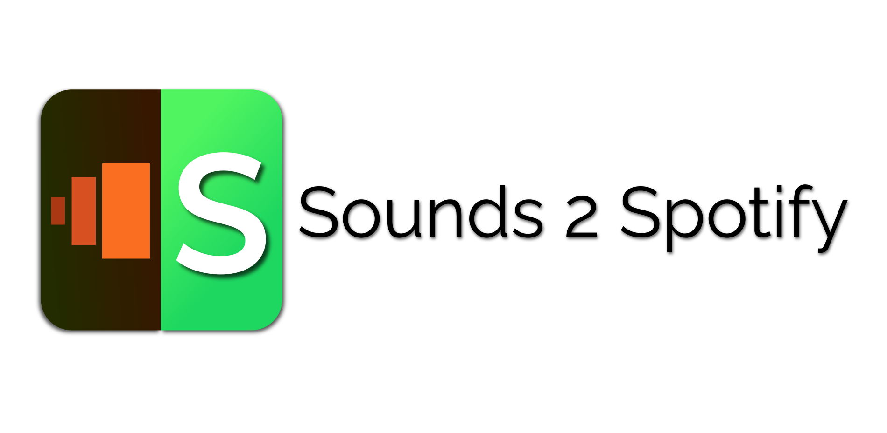

# Sounds2Spotify

This is a webextension that allows converting the tracklists on BBC Sounds shows to Spotify playlists.

# How to use
- [Create a spotify developer app](https://developer.spotify.com/dashboard/)

- Go to 'edit settings' and add the following redirect urls
  - https://hhdacdbpaahnphgholikdpeoebmmbkde.chromiumapp.org/
  - https://3d69fa306ad08ae7bed83b65fe8d9861be5c6fb6.extensions.allizom.org/

- Place your `client_id` and `client_secret` into `config.js`

- Install the extension

- Click on the extension icon in the toolbar while on a BBC sounds desktop programme page (https://www.bbc.co.uk/sounds/play/xxxxxx) 

# Installation

## Firefox
- Go to `about:debugging#/runtime/this-firefox` 
- Select 'Load Temporary Add-on...'
- Navigate to `manifest.json`

## Chrome
- Go to `chrome://extensions/`
- Enable developer mode
- Select 'Load unpacked extension'
- Select the Sounds2Spotify folder

## Example Playlists
- https://open.spotify.com/playlist/4bFGqYvu1qKO7ff5KZOWgY?si=142d57d4cf494f18

- https://open.spotify.com/playlist/0d16mBPBMrztUmwyo2nPhB?si=3441462b7fe1436e